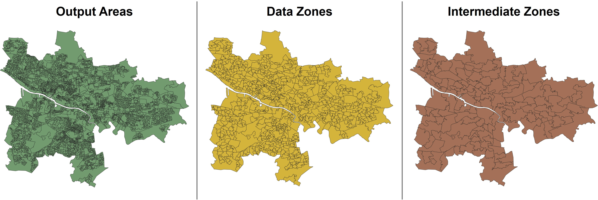

# Spatial Boundary
Scotland has its own names and standards for the census boundaries. The finest boundary level of Scotland is named as *Output Areas (OAs)* where they they include a minimum people of 50 and minimum household of 20. *Data Zones (DZs)* are formed in places where the population is over 500 and below 1000. *Intermediate Zones (IZs)* are formed in places where the population is over 2500 and below 6000. For more information, please visit: https://scotborders.gov.uk/info/20015/your_council/65/research_and_data/5


## Output Area
5486 for Glasgow (11.8%); 46,351 for the whole of Scotland

## Data Zones
746 for Glasgow (10.6%); 6976 covering the whole of Scotland

## Intermediate zones 
136 for Glasgow (10.6%); 1,279 covering the whole of Scotland.

```{r, echo=F, out.width="100%"}

```

