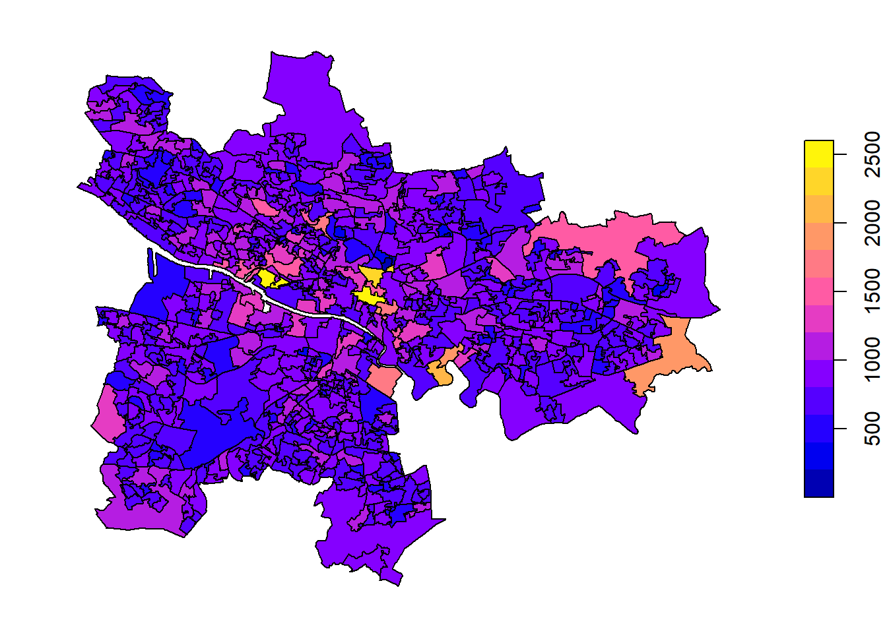

# Population

<!--Description -->

## Name

-   Small Area Population Estimates (SAPE) from the National Records of Scotland
-   Mid-2020 Population Estimates Scotland

## Year

2021 (Based on June 2020)

## Metadata

-   SAPE2017: 2017 NRS small area population estimates (Count)
-   WAPE2017: 2017 NRS small area population estimates and state pension age (Count)
-   Mid-2020 Population Estimates Scotland (Count). Detailed Metadata regarding the metrics, accuracy, and completeness are all linked [here](https://www.nrscotland.gov.uk/files//statistics/population-estimates/mid-20/mid-year-pop-est-20-metadata.pdf)
    -   Age

    -   Gender

## Source

-   Small area estimates: <https://www.nrscotland.gov.uk/statistics-and-data/statistics/statistics-by-theme/population/population-estimates/2011-based-special-area-population-estimates/small-area-population-estimates>
-   Scotland Mid-2020 by age and gender: [https://www.nrscotland.gov.uk/statistics-and-data/statistics/statistics-by-theme/population/population-estimates/mid-year-population-estimates/mid-2020](https://www.nrscotland.gov.uk/statistics-and-data/statistics/statistics-by-theme/population/population-estimates/mid-year-population-estimates/mid-2020#){.uri}

## Examples

(\#fig:unnamed-chunk-1)2017 NRS small area population estimates.

하이 헬로우 안녕

<table class="table" style="margin-left: auto; margin-right: auto;">
 <thead>
  <tr>
   <th style="text-align:left;"> DataZone </th>
   <th style="text-align:left;"> DZName </th>
   <th style="text-align:right;"> SAPE2017 </th>
  </tr>
 </thead>
<tbody>
  <tr>
   <td style="text-align:left;"> S01010260 </td>
   <td style="text-align:left;"> City Centre East - 02 </td>
   <td style="text-align:right;"> 2544 </td>
  </tr>
  <tr>
   <td style="text-align:left;"> S01010284 </td>
   <td style="text-align:left;"> Finnieston and Kelvinhaugh - 03 </td>
   <td style="text-align:right;"> 2429 </td>
  </tr>
  <tr>
   <td style="text-align:left;"> S01010286 </td>
   <td style="text-align:left;"> Finnieston and Kelvinhaugh - 05 </td>
   <td style="text-align:right;"> 2420 </td>
  </tr>
  <tr>
   <td style="text-align:left;"> S01010261 </td>
   <td style="text-align:left;"> City Centre East - 03 </td>
   <td style="text-align:right;"> 2269 </td>
  </tr>
  <tr>
   <td style="text-align:left;"> S01010048 </td>
   <td style="text-align:left;"> Dalmarnock - 03 </td>
   <td style="text-align:right;"> 2081 </td>
  </tr>
  <tr>
   <td style="text-align:left;"> S01010088 </td>
   <td style="text-align:left;"> Baillieston East - 01 </td>
   <td style="text-align:right;"> 1916 </td>
  </tr>
  <tr>
   <td style="text-align:left;"> S01010258 </td>
   <td style="text-align:left;"> Gallowgate North and Bellgrove - 05 </td>
   <td style="text-align:right;"> 1826 </td>
  </tr>
  <tr>
   <td style="text-align:left;"> S01010050 </td>
   <td style="text-align:left;"> Parkhead West and Barrowfield - 02 </td>
   <td style="text-align:right;"> 1822 </td>
  </tr>
  <tr>
   <td style="text-align:left;"> S01010257 </td>
   <td style="text-align:left;"> Gallowgate North and Bellgrove - 04 </td>
   <td style="text-align:right;"> 1732 </td>
  </tr>
  <tr>
   <td style="text-align:left;"> S01010314 </td>
   <td style="text-align:left;"> Keppochhill - 06 </td>
   <td style="text-align:right;"> 1682 </td>
  </tr>
</tbody>
</table>
