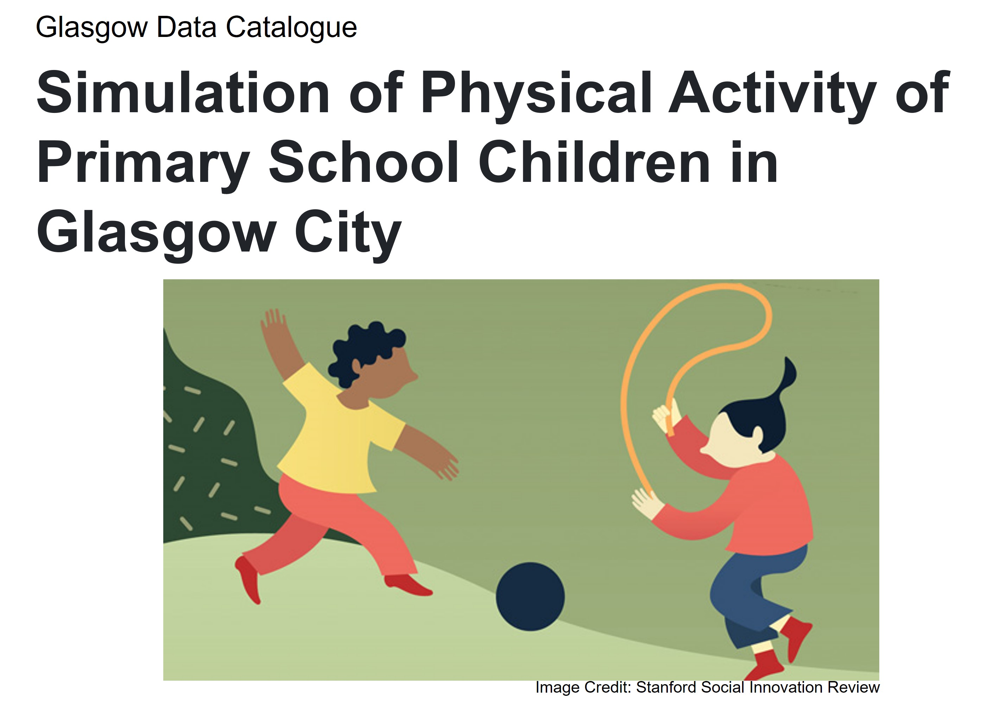

# About {-}

This Catalogue offers a handful of geospatial data used for the **Simulation of Physical Activity of Primary School Children in Glasgow City** project. It includes the city's boundary, population, environments, buildings, and so on. Feel free to browse through this book, and drop me a note if you have any enquiries.


```{r echo=FALSE, out.width="100%"}

```


**Hyesop Shin** <Research Associate at the MRC/CSO Social And Public Health Sciences Unit, University of Glasgow<br> **Bio** [here](https://www.gla.ac.uk/researchinstitutes/healthwellbeing/staff/hyesopshin/)

## Structure {-}
```markdown
directory/
├──  index.Rmd
├── 01-intro.Rmd
├── 02-sptial-boundary.Rmd
├── 03-population.Rmd
├── 04-school.Rmd
├── 05-buildings.Rmd
├── 06-land-use.Rmd
├── 07-demographics.Rmd
├── 08-health.Rmd
├── _bookdown.yml
├── _output.yml
├──  reference.bib
├──  preamble.tex
├──  GlasgowGIS
├──  images
├──  README.md
└──  style.css
```
